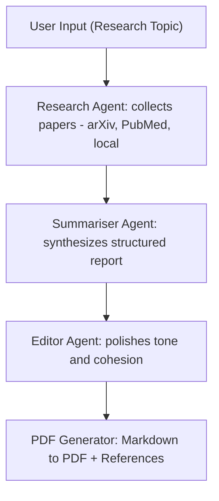

# ResearchMate 🧠📄 — Autonomous Research Assistant

[](https://www.python.org/)
[]()
[]()
[]()
[]()

ResearchMate is a **multi-agent backend system** that automates academic research: it **finds papers (arXiv/PubMed + local docs), synthesizes findings with Gemini, edits for clarity, and exports a structured PDF** — all from a single command.

---

## Problem → Solution
**Problem.** Literature reviews are slow and repetitive: searching, triaging, synthesizing, formatting, and referencing.

**Solution.** ResearchMate runs a **configurable pipeline**:
1) collect relevant articles,
2) synthesize them into a structured report,
3) polish tone/format,
4) export a professional **PDF** with references.

---

## Key Features
- 🔎 Multi-source ingestion: **arXiv, PubMed, local documents**
- 🤖 Multi-agent pipeline: **Research → Summariser → Editor**
- 📄 Professional export: **Markdown → PDF (ReportLab)**
- ⚙️ Config-driven, modular design
- 🧪 Backend-only (CLI). UI planned.

---

## Architecture (high level)




## 🧩 Module Map

| Layer | Folder / File | Purpose |
|:------|:---------------|:--------|
| **Agents** | `agents/research_agent.py` | 🧠 Gathers articles via integrated tools (arXiv, PubMed, Local) |
|  | `agents/summariser_agent.py` | ✍️ Synthesizes structured academic report with Gemini |
|  | `agents/editor_agent.py` | 🧹 Polishes clarity, tone, and formatting |
|  | `agents/base_agent.py` | ⚙️ Shared base class for all agents |
| **Tools** | `tools/arxiv_tool.py`, `tools/pubmed_tool.py` | 🔎 External search + metadata extraction |
|  | `tools/document_search_tool.py` | 📂 Local corpus matching for uploaded files |
|  | `tools/base_tool.py` | ⚙️ Common interface for all data tools |
| **Workflow** | `workflows/orchestrator.py` | 🧩 Orchestrates agent-to-agent flow (Research → Summarise → Edit → Export) |
| **Config** | `configs/settings.py`, `configs/pipeline_config.yaml` | 🛠️ API keys, runtime paths, feature toggles |
| **Outputs** | `outputs/articles/`, `outputs/final_report.pdf` | 📦 Generated research files & final PDF |
| **Docs** | `docs/ARCHITECTURE.md`, `docs/PROJECT_SUMMARY.md` | 🗂️ Technical documentation & architecture notes |


### Results & Metrics (typical run)
| Metric               | Result          | Notes                    |
|----------------------|-----------------|--------------------------|
| Avg runtime          | ~1m45s/topic    | 10 runs, laptop baseline |
| Articles fetched     | ~14             | arXiv + PubMed mix       |
| Content relevance    | ~85%            | Manual vs abstracts      |
| LLM tokens           | ~8k             | Prompt + context         |
| Hands-free automation| 100%            | Topic → PDF              |

_Numbers are indicative; your hardware, network, and API limits may vary._

### Quickstart
```bash
git clone <your-repo-url>
cd researchmate
python -m venv .venv && source .venv/bin/activate  # (Windows: .venv\Scripts\activate)
pip install -r requirements.txt
```

#### Configure
Edit `configs/settings.py`:

```python
GEMINI_API_KEY = "YOUR_KEY"
DATA_PATH = "data/"
OUTPUT_PATH = "outputs/"
```

#### Run
```bash
python main.py --topic "AI in Healthcare"
```

- **Artifacts:** `outputs/final_report.pdf`, `outputs/articles/*.pdf` (plus search traces)
- **Example Output:** See `outputs/final_report.pdf` for a sample generated on "AI in Healthcare".

### Tech Stack
| Layer | Tools | Role |
|-------|-------|------|
| Core | Python 3.10+ | Primary logic |
| Agents | Custom (CrewAI-style) | Research / Summarise / Edit |
| LLM | Gemini 1.5 Flash | Synthesis & editing |
| Data | arXiv, PubMed, local files | Sources |
| Export | ReportLab | PDF generation |
| Config | YAML + Python | Pipeline tuning |

### Roadmap
- Streamlit UI with live progress
- Dockerfile + GitHub Actions CI
- Batch topics & caching
- Source dedup + ranking
- Inline cite linking to PDFs
- Model adapters (OpenAI, Claude)

### Repository Structure
```text
researchmate/
├─ agents/
├─ tools/
├─ workflows/
├─ configs/
├─ outputs/
├─ docs/
│  ├─ ARCHITECTURE.md
│  └─ PROJECT_SUMMARY.md
├─ main.py
├─ requirements.txt
└─ README.md
```

### License & Author
- **License:** MIT (see `LICENSE`)
- **Author:** Yohannes Nigusse


