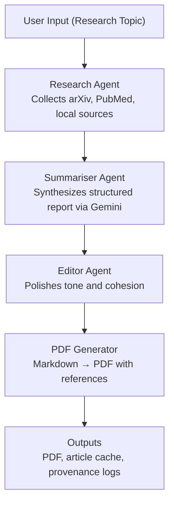

# ResearchMate 🧠📄 — Autonomous Research Assistant


[](https://www.python.org/)
[]()
[]()
[]()
[]()
[](./LICENSE)

> Multi-agent automation that turns any research topic into a polished, referenced PDF in one run.

---

## 📚 Table of Contents
- [📖 About the Project](#-about-the-project)
- [🎬 Demo / Preview](#-demo--preview)
- [⚙️ Tech Stack](#-tech-stack)
- [🚀 Features](#-features)
- [📦 Installation](#-installation)
- [🧠 Usage](#-usage)
- [🏗️ Architecture Overview](#-architecture-overview)
- [🧩 API / CLI Reference](#-api--cli-reference)
- [📈 Roadmap](#-roadmap)
- [🤝 Contributing](#-contributing)
- [👥 Contributors / Credits](#-contributors--credits)
- [📜 License](#-license)
- [🌐 Links & Resources](#-links--resources)
- [⭐ Acknowledgements](#-acknowledgements)
- [⬆️ Back to Top](#️-back-to-top-)

---

## 📖 About the Project
ResearchMate automates end-to-end literature reviews. It discovers relevant papers, synthesizes insights with Gemini, polishes tone, and exports a ready-to-share PDF—removing hours of manual work from researchers.

- **Problem:** Literature reviews demand repetitive searching, triaging, summarizing, formatting, and citation management. This is especially painful for students and faculty juggling multiple courses and deadlines.
- **Solution:** A configurable, multi-agent backend that orchestrates research, summarization, editing, and export from a single CLI invocation.
- **Audience:** Research assistants, graduate labs, librarians, and institutions piloting automated research workflows. Active collaboration with [Kibur College](https://www.linkedin.com/company/kibur-college/) explores an institutional rollout.

### Origin & Motivation
ResearchMate was inspired by my time as an Undergraduate Research Assistant at the Brain-Computer Interface Lab at Saint Cloud State University. While working on the [Avatar](https://github.com/3C-SCSU/Avatar) project, I saw how much time researchers spent manually searching, reading, and summarizing academic papers before they could actually begin their experiments. That bottleneck led to an automation-first approach for literature reviews.

---

## 🎬 Demo / Preview
| Asset | Description |
| --- | --- |
| `/docs/demo.gif` | CLI run-through: topic selection to PDF export. |
| `/outputs/final_report.pdf` | Sample PDF generated for “AI in Healthcare”. |
| `/docs/PROJECT_SUMMARY.md` | Executive summary of the pipeline and results. |

> Tip: Reproduce the sample PDF by running `python main.py --topic "AI in Healthcare"`.

---

## ⚙️ Tech Stack
| Layer | Technologies |
| --- | --- |
| Language | Python 3.10+ |
| Agents & Workflow | Custom orchestrator (CrewAI-inspired) |
| LLM | Gemini 1.5 Flash |
| Data Sources | arXiv, PubMed, local document corpus |
| Export | ReportLab (Markdown → PDF) |
| Config | YAML + Python settings |
| Tooling | Poetry/venv support, CLI tooling |

---

## 🚀 Features
- 🔎 Multi-source ingestion with arXiv, PubMed, and local PDFs.
- 🤖 Three-agent pipeline: Research → Summariser → Editor.
- 🧠 Structured synthesis with sections, numbered references, and citations.
- 📝 Tone and cohesion polishing for publication-ready prose.
- 📄 Markdown-to-PDF export with references and appendix.
- 🔁 Configurable pipelines for labs, courses, and institutions.
- 📂 Outputs include article cache, synthesis traces, and final PDF.

---

## 📦 Installation
```bash
# Clone the repository
git clone <your-repo-url>
cd researchmate

# Create and activate a virtual environment
python -m venv .venv
source .venv/bin/activate  # Windows: .venv\Scripts\activate

# Install dependencies
pip install -r requirements.txt
```

### Configure
Edit `configs/settings.py` (or mirror values via environment variables):

```python
GEMINI_API_KEY = "YOUR_KEY"
DATA_PATH = "data/"
OUTPUT_PATH = "outputs/"
```

Optional tuning lives in `configs/pipeline_config.yaml` for max article counts, agent parameters, and export settings.

---

## 🧠 Usage
Generate a literature review for any topic:

```bash
python main.py --topic "AI in Healthcare"
```

Outputs include:
- `outputs/final_report.pdf` — polished PDF report with references.
- `outputs/articles/` — cached article PDFs and metadata.
- `outputs/logs/` (if enabled) — agent traces and run metadata.

### Advanced Options
<details>
<summary>CLI Arguments</summary>

| Flag | Description |
| --- | --- |
| `--topic TEXT` | Research topic or question (required). |
| `--max-articles INT` | Limit the number of collected articles (default from config). |
| `--config PATH` | Use an alternate YAML pipeline configuration. |
| `--local-corpus PATH` | Include additional local PDFs for retrieval. |
| `--output PATH` | Override the default output directory. |

</details>

---

## 🏗️ Architecture Overview



### Module Map
| Layer | Location | Purpose |
| --- | --- | --- |
| Agents | `agents/research_agent.py` | Aggregates articles and builds `{title, content}` payloads. |
|  | `agents/summariser_agent.py` | Produces structured academic reports with numbered references. |
|  | `agents/editor_agent.py` | Refines tone, clarity, and cohesion. |
|  | `agents/base_agent.py` | Shared agent scaffolding and utilities. |
| Tools | `tools/arxiv_tool.py`, `tools/pubmed_tool.py` | External search and metadata normalization. |
|  | `tools/document_search_tool.py` | Local corpus similarity search for uploaded files. |
|  | `tools/base_tool.py` | Tool abstraction layer. |
| Workflow | `workflows/orchestrator.py` | Orchestrates Research → Summarise → Edit → Export, tracks provenance. |
| Config | `configs/settings.py`, `configs/pipeline_config.yaml` | Runtime paths, API keys, feature toggles, limits. |
| Outputs | `outputs/` | Article cache, final PDF, run artifacts. |
| Docs | `docs/ARCHITECTURE.md`, `docs/PROJECT_SUMMARY.md` | Deeper architecture and project context. |

---

## 🧩 API / CLI Reference
| Command | Description |
| --- | --- |
| `python main.py --topic "<topic>"` | Run the full research pipeline for the given topic. |
| `python main.py --topic "<topic>" --max-articles 10` | Cap article ingestion to a fixed number. |
| `python main.py --topic "<topic>" --local-corpus ./pdfs` | Add a local PDF corpus to the search space. |
| `python main.py --topic "<topic>" --config ./configs/custom.yaml` | Override default pipeline configuration. |
| `python main.py --topic "<topic>" --output ./reports` | Change the export destination. |

---

## 📈 Roadmap
- [ ] Streamlit UI with real-time pipeline telemetry.
- [ ] Docker image and GitHub Actions CI.
- [ ] Batch topic ingestion and caching layer.
- [ ] Source deduplication and ranking heuristics.
- [ ] Inline citation hyperlinks to cached PDFs.
- [ ] Pluggable LLM adapters (OpenAI, Claude, local). 

---

## 🤝 Contributing
Contributions are welcome!

1. Fork the repository and create a feature branch.
2. Install dependencies via `pip install -r requirements.txt`.
3. Add or update tests/docs when relevant.
4. Submit a PR describing your changes and any testing performed.

For larger ideas, open an issue first or reach out so we can collaborate on design.

---

## 👥 Contributors / Credits
| Contributor | Role |
| --- | --- |
| Yohannes Nigusse | Creator & Maintainer |

Want to join the Hall of Fame? Open a PR!

---

## 📜 License
Distributed under the [MIT License](./LICENSE). Feel free to fork, adapt, and build on ResearchMate with attribution.

---

## 🌐 Links & Resources
- Documentation: `docs/ARCHITECTURE.md`
- Project Summary: `docs/PROJECT_SUMMARY.md`
- Sample Output: `outputs/final_report.pdf`
- Institutional Pilot Partner: [Kibur College](https://www.linkedin.com/company/kibur-college/)
- Inspiration: [Avatar](https://github.com/3C-SCSU/Avatar) BCI research platform

---

## ⭐ Acknowledgements
- Brain-Computer Interface Lab, Saint Cloud State University, for research inspiration.
- arXiv and PubMed for open-access scholarly datasets.
- Gemini 1.5 Flash for reliable multi-step synthesis.

---

## ⬆️ Back to Top ↑
