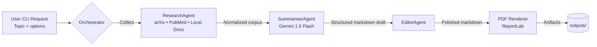

# ResearchMate Architecture

## Overview
ResearchMate is a CLI-first, multi-agent backend that automates the end-to-end literature review workflow. Each agent is responsible for a well-defined slice of the pipeline—collection, synthesis, editing, and publishing—while shared infrastructure handles configuration, data exchange, and state management.

## Runtime Flow

## Execution Stages
1. **Topic intake** – CLI parameters are parsed, validated, and handed to the orchestrator.
2. **Acquisition** – `ResearchAgent` fans out to enabled tools (arXiv, PubMed, or local search) and returns a normalized article list (`title`, `abstract/body`, `source`).
3. **Synthesis** – `SummariserAgent` composes a draft report (Title, Executive Summary, Key Findings, Discussion, Conclusion, References) using Gemini.
4. **Editing** – `EditorAgent` refines tone, ensures section completeness, and aligns citation numbering.
5. **Publishing** – The PDF renderer converts markdown into a styled PDF, writing the report and any supporting exports to `outputs/`.

## Component Responsibilities
| Layer | Location | Role |
|:------|:---------|:-----|
| **Entry Point** | `main.py` | CLI parsing, pipeline bootstrap, logging setup |
| **Workflow** | `workflows/orchestrator.py` | Coordinates agents, manages shared context, enforces execution order |
| **Agents** | `agents/*.py` | Encapsulate LLM prompts, tool usage, and output contracts |
| **Tools** | `tools/*.py` | External integrations for literature retrieval and local document search |
| **Config** | `configs/settings.py`, `configs/pipeline_config.yaml` | Runtime options, credentials, rate limits, feature toggles |
| **Outputs** | `outputs/` | Persisted artifacts: fetched articles, synthesized report, final PDF |

## Data Handling
- Articles are stored as lightweight dictionaries while in memory; serialized artifacts land in `outputs/articles/`.
- Markdown drafts preserve citation numbering (`[1]`, `[2]`, …) to keep the editor and PDF stages deterministic.
- PDF rendering uses ReportLab stylesheets tuned for academic layout (title page, table of contents optional, section headings).

## Extensibility
- **Swap LLM provider:** Implement a new summariser agent or configure alternate model endpoints in `configs/settings.py`.
- **Add retrieval sources:** Subclass `BaseTool` and register it in `pipeline_config.yaml`.
- **Change exporters:** Replace the PDF renderer with another format (e.g., DOCX) by providing a class that consumes the final markdown payload.

## Operational Notes
- Designed for Python 3.10+; dependency management handled via `requirements.txt`.
- Long-running operations (API calls, file exports) are isolated per agent to simplify retries and logging.
- Secrets (API keys, tokens) should be injected through environment variables or `.env` files excluded from version control.
